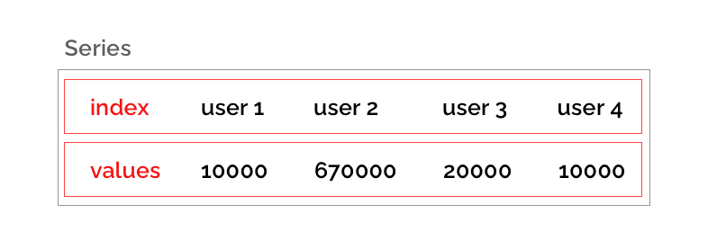
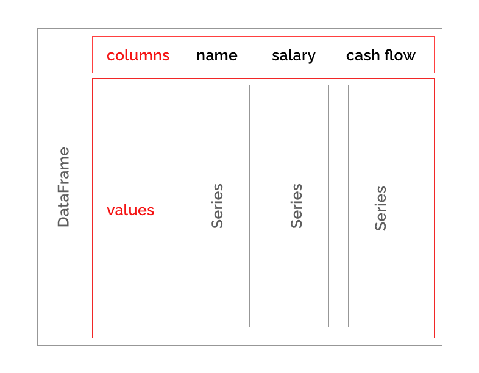

## Třída `Index`
Modul `Index.java` obsahuje třídu `Index` sloužící k indexaci libovolné sekvence hodnot.

Třída obsahuje následující vlastnosti:
* `Index.labels` - seznam klíču (labelů) - nesmí obsahovat duplicity (vyvolá vyjimku `ValueError`) - musí mít alespoň jeden prvek (jinak vyvolá vyjimku `ValueError`).
* `Index.name` - volitelná vlastnost obsahující název indexu, výchozí hodnota na `""`.

Třída obsahuje následující metody:
* `Index.get_loc(self, key)` - přeloží klíč `key` z `Index.labels` na odpovídající index. Pokud není klíč přítomen vyvoláme výjimku `KeyError`.

## Třída `Series`
Modul `Series.java` obsahuje třídu `Series`, která uchovává posloupnost hodnot indexovaných dle objektu třídy `Index`.



Třída obsahuje následující vlastnosti:
* `Series.values` - seznam hodnot uložený v posloupnosti, musí obsahovat alespoň jeden prvek jinak vyvolá `ValueError`.
* `Series.index` - index sloužící k indexaci `Series.values`, musí být stejné délky jako `Series.values` jinak vyvolá `ValueError`. Pokud byla počáteční hodnota `null` vytvoříme index nový, `Index.labels` nastavíme na hodnoty `0` až `n` kde `n` je délka `Series.values`.

Třída obsahuje následující metody:
* `Series.get(self, key)` - pokud `Series.index` obsahuje `key`, vrátí odpovídající hodnotu z `Series.values`, jinak vrací `None`.
* `Series.max(self)` - nalezne maximální hodnotu z posloupnosti, detailní popis níže
* `Series.min(self)` - nalezne minimální hodnotu z posloupnosti, analogicky k max variantě
* `Series.apply(self, func)` - aplikuje libovolnou funkci na prvky posloupnosti, detailní popis níže

Dále bude možné provádět jednoduché operace na datech uložených v `Series`. Konkrétně:

### Metoda `Series.max()`/`Series.min()`
Maximální hodnota v `Series`.

```java
var users = new Index(new ArrayList<String>(Arrays.asList("user 1", "user 2", "user 3", "user 4")), name="names");
var cash_flow = new Series<Integer>(Arrays.asList(-100, 10000, -2000, 1100), index=users);
assert cash_flow.max() == 10000;
assert cash_flow.min() == -2000;
```

### Metoda `Series.apply(Function<T, T> func)` 
Která aplikuje funkci `func` na všechny prvky `Series` a vrátí `Series` novou (s vypočítanými hodnotami). Původní `Series` nemodifikuje!

```java
public static int squared(a){
    return a ** 2
}
var users = new Index(new ArrayList<String>(Arrays.asList("user 1", "user 2", "user 3", "user 4")), name="names");
var cash_flow = new Series<Integer>(Arrays.asList(-100, 10000, -2000, 1100), index=users);
var result = cash_flow.apply(squared);
assert cash_flow.equals(result) == false;
assert result.getValues() == new ArrayList<Integer>(Arrays.asList(10000, 100000000, 4000000, 1210000));
```

## Třída `DataFrame`
Modul `Dataframe.java` obsahuje třídu `DataFrame`, která slouží k reprezentaci tabulky dat. Tabulka je složena ze sloupců (alespoň jeden sloupec, každý sloupec je tvořen instancí třídy `Series`). Sloupce jsou indexovány pomoci instance třídy `Index`.



Třída obsahuje následující vlastnosti:
* `DataFrame.getValues` - seznam instancí třídy `Series`, reprezentuje hodnoty sloupců, musí obsahovat alespoň jeden prvek jinak vyvolá `ValueError`.
* `DataFrame.columns` - index sloužící k indexaci `DataFrame.values`, musí být stejné délky jako `DataFrame.values` jinak vyvolá `ValueError`. Pokud byla počáteční hodnota `None` vytvoříme index nový, `Index.labels` nastavíme na hodnoty `0` až `n` kde `n` je délka `DataFrame.values`.

Třída obsahuje následující metody:
* `DataFrame.get(String key)` - pokud `DataFrame.columns` obsahuje `key`, vrátí odpovídající sloupec (`Series`) z `DataFrame.values`, jinak vrací `null`.

```java
var users = new Index(new ArrayList<String>(Arrays.asList("user 1", "user 2", "user 3", "user 4")), name="names");

var salaries = new Series<Integer>(Arrays.asList(20000, 10000, 300000, 20000, 50000), index=users);
var names = new Serie<String>(new ArrayList<String>(Arrays.asList("Lukas Novak", "Petr Pavel", "Pavel Petr", "Ludek Skocil")), index=users);
var cash_flow = new Serie<Integer>(new ArrayList<Integer>(Arrays.asList(-100, 10000, -2000, 1100)), index=users);

var series = new ArrayList<Serie>(Arrays.asList(names, salaries, cash_flow));
var index = new Index(new ArrayList<String>(Arrays.asList("names, "salary", "cash flow"));

var data = new DataFrame(series, columns=index);
assert data.get("salary") == salaries
assert data.get("cash flow").max() == 10000
```
